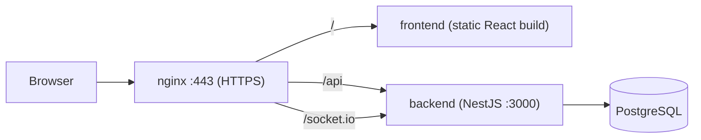

# Architecture

## Stack
| Layer | Technology |
|---|---|
| Frontend | React + Vite + TypeScript, Tailwind CSS, React Router |
| Backend | NestJS (TypeScript) |
| Database | PostgreSQL (ORM to be added) |
| Real-time | Socket.IO (to be added) |
| Reverse proxy / HTTPS | nginx (self-signed certificate) |
| Containers | Docker Compose |

## Diagram

## Routing
- `/` serves the React app (SPA fallback to `index.html`).
- `/api/*` goes to the backend (global prefix `api`).
- `/socket.io/*` goes to the backend with WebSocket upgrade.

## Decisions
Record the reasoning for each major choice (framework, DB, auth, real-time) in Confluence under "Decisions" and summarise it in the README "Technical Stack" table.
