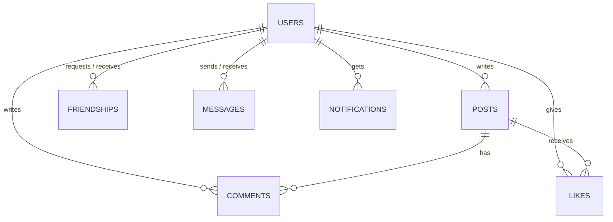

# Database schema (draft)

Update this file as the schema evolves; the README links here.

| Table | Key fields | Notes |
|---|---|---|
| users | id, email (unique), password_hash, display_name, avatar_url, created_at | passwords hashed and salted |
| posts | id, author_id, content, image_url, created_at | |
| comments | id, post_id, author_id, content, created_at | |
| likes | user_id, post_id | unique pair |
| friendships | requester_id, addressee_id, status | pending / accepted |
| messages | id, sender_id, receiver_id, content, created_at, read_at | |
| notifications | id, user_id, type, payload, read, created_at | |
